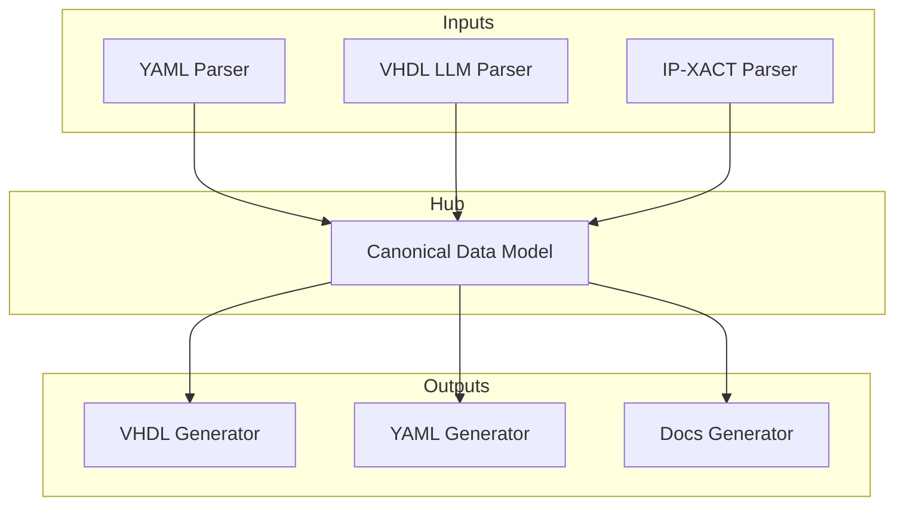

# IP Core Manager - System Architecture

This document describes the high-level architectural decisions and patterns used in the `ipcore_lib` project.

## 1. Core Philosophy

The system is designed around the **"Hub and Spoke"** architecture to solve the M-to-N conversion problem (M input formats $\leftrightarrow$ N output formats).

### The Hub: Canonical Data Model
A single source of truth (`IpCore` class) that represents an IP core in a format-agnostic way.
*   **Implementation**: `ipcore_lib.model.*`
*   **Technology**: Pydantic `BaseModel`
*   **Why**: Strong validation of untrusted external data. Fail-fast behavior for invalid inputs.

### The Spokes: Strategies
*   **Parsers**: Strategies that convert input format $\rightarrow$ Canonical Model.
*   **Generators**: Strategies that convert Canonical Model $\rightarrow$ output format.
*   **Extensibility**: Adding a new format requires only 1 new parser/generator, not N converters.

---

## 2. Key Design Patterns

### Strategy Pattern
Used for parsers and generators. The core logic doesn't care *how* a file is parsed, only that it returns an `IpCore` object.

### Factory Pattern
Used to instantiate the correct strategy based on file extension or user selection.

### Facade Pattern
The `IpCoreManager` (or `scripts/ipcore.py`) provides a simple interface for users, hiding the complexity of parser selection and model validation.

---

## 3. Data Integrity & Validation

We chose **Pydantic** over Python `dataclasses` because:
1.  **Coercion**: Handles string-to-int conversion for CLI/YAML inputs automatically.
2.  **Validation**: Enforces constraints (e.g., `width > 0`) at the boundary.
3.  **Serialization**: Built-in JSON/dict export makes generator implementation trivial.

### Smart Models, Dumb Templates
Logic is pushed down into the Pydantic models as computed `@property` fields.
*   **Bad**: Template having logic `...`
*   **Good**: Template just printing `{{ port.range_string }}`
*   **Result**: Templates are clean, readabale, and models are easily testable unit-wise.

---

## 4. Parser Architecture

### Pure LLM Parsing (VHDL)
For complex HDL parsing, we moved from rigid grammars (pyparsing) to **AI-Native Parsing**.
*   **Theory**: LLMs understand semantic context better than regex/BNF.
*   **Implementation**: `ipcore_lib.parser.hdl.vhdl_ai_parser`
*   **Detail**: See `ipcore_lib/parser/docs/ARCHITECTURE.md`

---

## 5. Technology Stack

*   **Language**: Python 3.10+
*   **Package Manager**: `uv`
*   **Testing**: `pytest`
*   **Validation**: `pydantic`
*   **templating**: `jinja2`
*   **LLM Integration**: `llm_core` (Ollama/OpenAI support)
