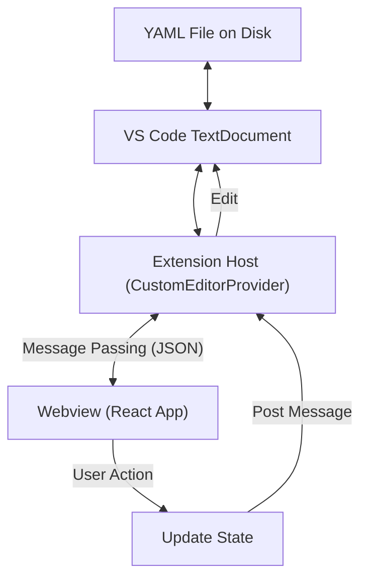

# VS Code Extension Plan: FPGA Memory Map Visual Editor

## 1. Executive Summary

This document outlines the architectural and implementation plan for a Visual Studio Code extension that brings the functionality of the **Python/Qt Memory Map Editor** and the robustness of the **Pydantic data models** into the VS Code environment.

**Goal:** Create a seamless, integrated "Custom Editor" within VS Code that allows developers to visually edit FPGA memory map YAML files while maintaining the strict validation and structure defined by the project's Pydantic models.

## 2. Core Concepts & Inspiration

### 2.1. The "Memory Map Editor" Concept
*   **Visual Representation:** Instead of editing raw YAML text, users interact with a GUI representing Registers, Register Arrays, and BitFields.
*   **BitField Visualization:** A graphical view of the 32-bit (or n-bit) register layout, showing occupied and free bits.
*   **Hierarchical Navigation:** A tree view to navigate the address space.

### 2.2. The "Pydantic Model" Concept
*   **Single Source of Truth:** The extension will respect the schema defined in `fpga_lib.model`.
*   **Strict Validation:** Data entered in the UI must be validated against the model rules (e.g., overlapping addresses, valid identifiers).
*   **Schema-Driven UI:** The UI forms should ideally be derived from the data schema, ensuring that the UI always matches the underlying model.

## 3. Architecture

The extension will use the **VS Code Custom Editor API**. This allows the extension to "own" `.yaml` or `.memmap.yml` files and present a custom UI instead of (or alongside) the default text editor.

### 3.1. High-Level Components

1.  **Extension Host (TypeScript/Node.js):**
    *   Registers the `CustomTextEditorProvider`.
    *   Handles file I/O (reading/writing the YAML document).
    *   Manages the synchronization between the text model and the visual model.
    *   (Optional) Spawns a Python subprocess for advanced validation if strict Pydantic parity is required.

2.  **Webview Frontend (React + VS Code Webview UI Toolkit):**
    *   Renders the actual UI inside the editor tab.
    *   **Framework:** React (for component-based state management).
    *   **UI Library:** [VS Code Webview UI Toolkit](https://github.com/microsoft/vscode-webview-ui-toolkit) (to match VS Code's native look and feel automatically).
    *   **State Management:** Redux or React Context to handle the complex state of the memory map.

3.  **Data Layer (Shared Schema):**
    *   **JSON Schema:** We will generate a JSON Schema from the Python Pydantic models. This schema will serve two purposes:
        1.  Provide IntelliSense and validation in the *text* view of the YAML file.
        2.  Drive the validation logic in the *visual* editor (TypeScript types generated from the schema).

### 3.2. Data Flow

## 4. UI/UX Design

The UI will be designed to feel native to VS Code. It will support VS Code's color themes (Dark/Light/High Contrast) automatically.

### 4.1. Layout Strategy: Master-Detail

*   **Left Panel (Navigation):** A searchable Tree View displaying the hierarchy:
    *   Memory Map (Root)
        *   Register Array
        *   Register
*   **Right Panel (Editor & Visualization):** Context-sensitive editor based on selection.
    *   **Header:** Breadcrumbs and high-level actions (Delete, Duplicate).
    *   **Properties Form:** Inputs for Name, Description, Address Offset, Access Type.
    *   **BitField Visualizer:** (Only when a Register is selected)
        *   A horizontal bar representing 32 bits.
        *   Occupied bits are colored blocks.
        *   Empty bits are grayed out.
        *   **Interaction:** Click a bit range to create a new field or edit an existing one. Hover for details.

### 4.2. Key UX Features

1.  **Live Synchronization:**
    *   Changes in the visual editor update the underlying text file in real-time (dirty indicator appears on the tab).
    *   "Split View" support: Users can open the Text editor and Visual editor side-by-side. Typing in the text editor updates the visual view immediately.

2.  **Validation Feedback:**
    *   If the user enters an invalid value (e.g., overlapping address), the input field turns red, and a validation message appears.
    *   We can leverage VS Code's "Problems" panel to show errors found by the Pydantic validation logic.

3.  **Schema-Driven Forms:**
    *   The UI for editing properties will be generated based on the field definitions.
    *   *Example:* If the Pydantic model has an `Enum` for `AccessType` (RW, RO, WO), the UI will automatically render a Dropdown menu with those options.

## 5. Implementation Plan

### Phase 1: Foundation & Schema
1.  **Generate JSON Schema:** Create a script to export `fpga_lib.model` Pydantic models to JSON Schema (`IpCore.model_json_schema()`).
2.  **Scaffold Extension:** Initialize a new VS Code extension with a Webview provider.
3.  **TypeScript Interfaces:** Generate TypeScript interfaces from the JSON Schema (using tools like `json-schema-to-typescript`).

### Phase 2: The Visualizer (Frontend)
1.  **BitField Component:** Implement the interactive bitfield bar using SVG or CSS Grid.
    *   *Challenge:* Handling different register widths (32, 64).
2.  **Tree View:** Implement the navigation tree.
3.  **Property Editors:** Create reusable form components (Text, Number, Select) using VS Code UI Toolkit.

### Phase 3: Integration (Backend)
1.  **YAML Parsing:** Use a robust YAML parser in the extension host (e.g., `yaml` npm package) that preserves comments and line numbers if possible (though strict preservation is hard, we might focus on data correctness first).
2.  **Message Passing:** Implement the protocol for `updateDocument` and `updateWebview`.
3.  **Undo/Redo:** Integrate with VS Code's native Undo/Redo stack.

### Phase 4: Advanced Features (The "Pydantic" Brain)
1.  **Python Bridge (Optional but Recommended):**
    *   To ensure *exact* parity with the Python logic, the extension can bundle a small Python script.
    *   When the document is saved, the extension sends the JSON to the Python script.
    *   The Python script runs `IpCore.model_validate()` and returns any errors.
    *   These errors are displayed in the VS Code "Problems" panel.

## 6. Technical Stack Recommendation

*   **Extension:** TypeScript
*   **UI Framework:** React
*   **UI Components:** `@vscode/webview-ui-toolkit`
*   **Icons:** `@vscode/codicons`
*   **Build Tool:** Webpack or Esbuild (standard for VS Code extensions)
*   **State Management:** Redux Toolkit (for managing the complex nested state of a memory map)

## 7. Next Steps

1.  Run the schema generation script to see the JSON structure.
2.  Create a "Hello World" Custom Editor extension.
3.  Prototype the BitField Visualizer in a standalone HTML page.
